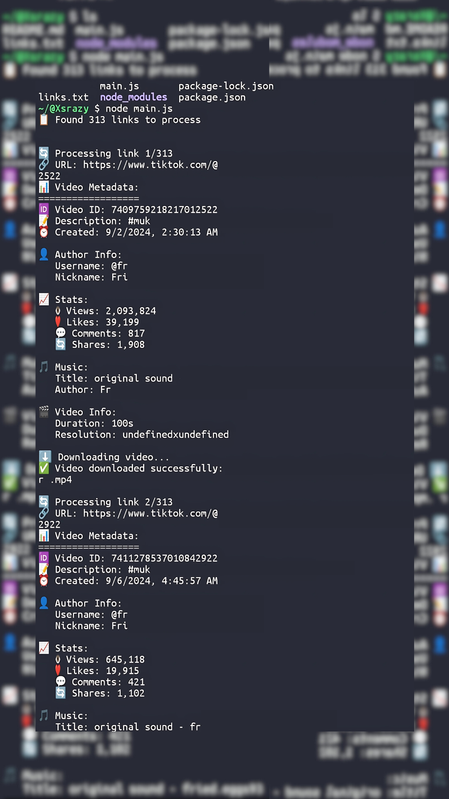

# 🎬 TikTok Batch Downloader (No Watermark)

🌐 Available in other languages: [Bahasa Indonesia](README.md)


Sebuah alat CLI Node.js sederhana untuk mengunduh banyak video TikTok tanpa watermark, lengkap dengan ekspor metadata dan penanganan error otomatis.



## 🚀 Fitur

- 🎥 Unduh video TikTok tanpa watermark
- ⏳ Proses batch melalui `links.txt`
- 📊 Ekspor metadata (format JSON)
- 🚫 Log error tersimpan otomatis
- 📁 Struktur folder rapi

## 💡 Cara Penggunaan

1. Clone repositori:
   ```bash
   git clone https://github.com/xsrazy/TikTok-Batch-Downloader
   cd tiktok-batch-downloader
   ```

2. Instal dependensi:
   ```bash
   npm install
   ```

3. Masukkan semua tautan video ke file `links.txt`

4. Jalankan alat:
   ```bash
   node main.js
   ```

---

## 📁 Struktur Output
```
downloads/
├── video_1/
│   ├── video.mp4
│   └── metadata.json
├── video_2/
│   ├── video.mp4
│   └── metadata.json
...
```

### 🔍 Isi File `metadata.json`
Setiap video akan disertai file `metadata.json` yang berisi informasi lengkap:

| Field           | Keterangan                                |
|-----------------|-------------------------------------------|
| `id`            | ID unik video TikTok                      |
| `url`           | URL lengkap video                         |
| `author`        | Username (misal: `@xsrazy`)               |
| `description`   | Caption atau isi teks video               |
| `hashtags`      | Daftar hashtag dalam video (`#tag`)       |
| `music`         | Judul atau sumber suara                   |
| `created_at`    | Tanggal upload video (format ISO)         |
| `stats.plays`   | Jumlah penayangan                         |
| `stats.likes`   | Jumlah suka                               |
| `stats.comments`| Jumlah komentar                           |
| `stats.shares`  | Jumlah dibagikan                          |
| `downloaded_at` | Waktu saat video diunduh melalui alat ini |

---

## 📋 Contoh Isi `links.txt`
```
https://www.tiktok.com/@user/video/1234567890123456789
https://www.tiktok.com/@anotheruser/video/9876543210987654321
```

---

## 🧠 Tips
- Pastikan tautan valid dan video bersifat publik (bukan private)
- Jangan mengunduh ribuan video sekaligus (batasi jumlah batch)
- Gunakan hanya untuk keperluan arsip, edukasi, atau backup pribadi
- Anda bisa menggunakan ekstensi Link Grabber atau scraper buatan sendiri untuk mengambil tautan video

## 💻 Dibuat oleh
**[@xsrazy](https://github.com/xsrazy)** — penggiat open-source  
Silakan fork, beri bintang ⭐, dan kontribusi!

## 📣 Rilis
🎉 **Rilis Pertama:** `v1.0.0`
- Downloader TikTok CLI tanpa watermark
- Proses batch
- Ekspor metadata JSON
- Deteksi duplikat dan log error

> Siap digunakan untuk kreator konten, backup video, atau analisis pribadi!

## 🧾 [](LICENSE.md)

Lisensi MIT – lihat file [LICENSE](LICENSE) untuk detail.


---
